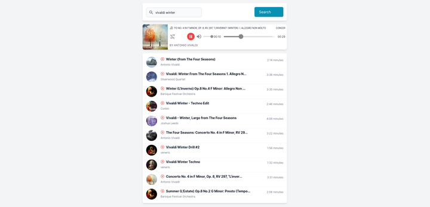

## Music Player Application

#### data source 
> https://rapidapi.com/Glavier/api/spotify23/

#### setup .env

```
NEXT_PUBLIC_API_KEY=API-Key
NEXT_PUBLIC_API_HOST=API-Host
```

#### running

```
cd nextjs-tailwind-audio
npm i
npm run dev
```

#### screenshot




#### demo

https://nextjs-tailwind-audio.vercel.app/